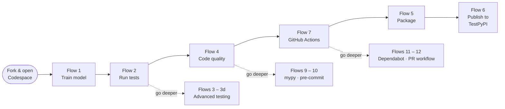
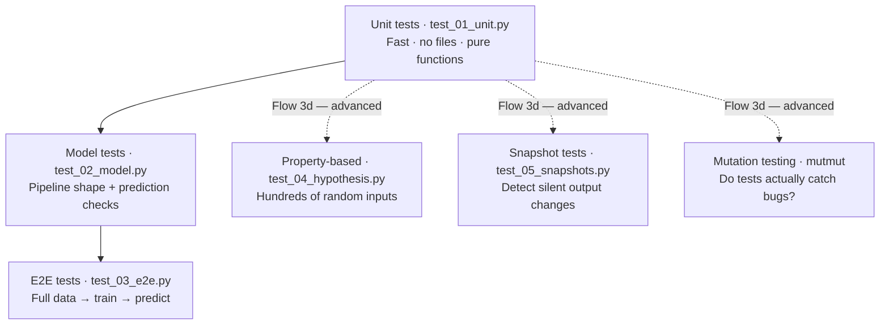
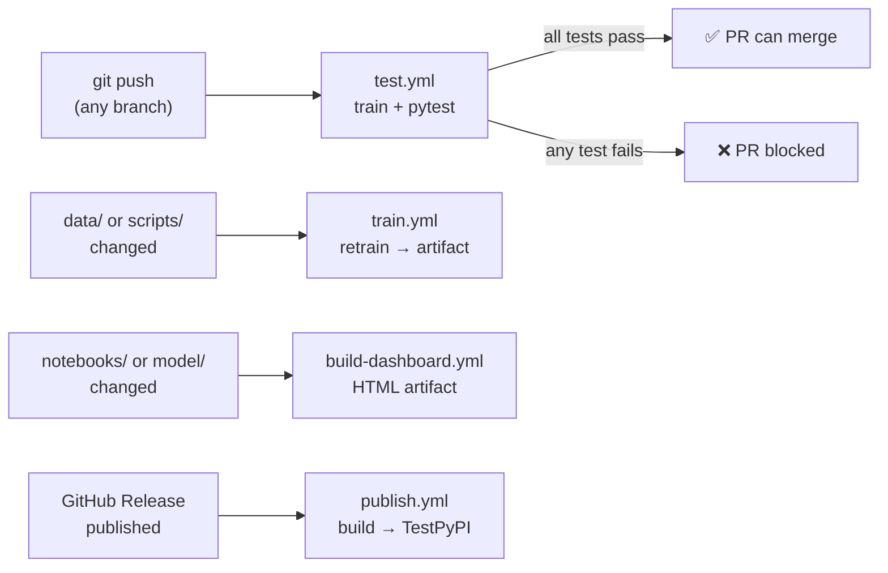
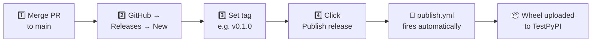

# CI/CD Template : Cardiovascular Risk Prediction

A hands-on teaching template that walks you through the **full modern Python ML workflow**.

## Learning journey



> **New here? Follow the solid arrows.** Each core flow takes 5–15 minutes.
> Dashed paths are optional — come back to them once the core path works.

### Tools at a glance

| What you will learn | Tool |
|---|---|
| Reproducible environments | [Pixi](https://pixi.sh) |
| Training an ML model | [scikit-learn](https://scikit-learn.org) |
| Writing and running tests | [pytest](https://pytest.org) |
| Unit / E2E / property-based / snapshot / mutation testing | pytest · [Hypothesis](https://hypothesis.readthedocs.io/) · [Syrupy](https://github.com/syrupy-project/syrupy) · [mutmut](https://mutmut.readthedocs.io/) |
| Code quality (lint + format) | [Ruff](https://docs.astral.sh/ruff/) |
| Type checking | [mypy](https://mypy.readthedocs.io/) |
| Interactive dashboard | [Marimo](https://marimo.io) |
| Packaging a Python library | `pyproject.toml` + `build` |
| Publishing to TestPyPI | `twine` / GitHub Actions |
| Automated CI/CD pipelines | [GitHub Actions](https://docs.github.com/en/actions) |

---

## Dataset acknowledgment

The synthetic data in `data/data.csv` was generated to match the schema of the
**Cardiovascular Disease Dataset** published on Kaggle by Svetlana Ulaanova:

> [https://www.kaggle.com/datasets/sulianova/cardiovascular-disease-dataset](https://www.kaggle.com/datasets/sulianova/cardiovascular-disease-dataset)

All values in this repository are **synthetic** and are used for teaching purposes only.
Credit and thanks to the original dataset creator.

---

## Project structure

```
ci-cd-template/
├── .github/
│   └── workflows/
│       ├── test.yml             # runs on every push: train → pytest
│       ├── train.yml            # runs when data/ or scripts/ change
│       ├── build-dashboard.yml  # rebuilds the HTML dashboard artifact
│       └── publish.yml          # publishes to TestPyPI on GitHub Release
│
├── data/
│   └── data.csv                 # synthetic cardiovascular dataset (60 rows)
│
├── model/
│   └── .gitkeep                 # directory tracked; model.joblib is git-ignored
│
├── notebooks/
│   └── dashboard.py             # Marimo interactive prediction dashboard
│
├── scripts/
│   └── train.py                 # training entry-point (pixi run train)
│
├── src/
│   └── ci_cd_template/
│       ├── __init__.py          # package exports
│       ├── model.py             # train_model() — StandardScaler + LogisticRegression
│       └── predict.py           # predict()    — load model, score one patient
│
├── tests/
│   ├── conftest.py              # shared pytest fixtures
│   ├── test_01_unit.py          # Flow 2 — pure function unit tests
│   ├── test_02_model.py         # Flow 2 — model prediction tests
│   ├── test_03_e2e.py           # Flow 2 — end-to-end pipeline tests
│   └── incoming/                # move files here → tests/ as you progress
│       ├── test_04_hypothesis.py    # Flow 3d — property-based tests
│       └── test_05_snapshots.py     # Flow 3d — snapshot tests
│
├── .env.example                 # copy to .env and fill in your tokens
├── .gitignore
├── LICENSE
├── pixi.toml                    # environment + task runner
├── pyproject.toml               # package metadata + tool config
└── README.md
```

---

## Getting started

### Option A — GitHub Codespaces (recommended, zero local setup)

Codespaces gives you a full Linux dev environment in your browser.

1. **Fork this repository**
   Click **Fork** (top-right on GitHub) → keep the default name → **Create fork**

2. **Open a Codespace on your fork**
   Click **Code** → **Codespaces** tab → **Create codespace on main**
   Wait ~60 s for the container to start.

3. **Install Pixi** (in the Codespace terminal)
   ```bash
   curl -fsSL https://pixi.sh/install.sh | sh
   source ~/.bashrc        # reload shell so `pixi` is on PATH
   pixi --version          # should print e.g.  pixi 0.x.x
   ```

4. **Install project dependencies**
   ```bash
   pixi install
   ```
   Pixi reads `pixi.toml`, solves the dependency graph, and installs everything
   (Python 3.11, pandas, scikit-learn, pytest, ruff, marimo, twine, …) into an
   isolated `.pixi/` environment.

### Option B — Local clone

```bash
# 1. Fork on GitHub, then clone your fork
git clone https://github.com/<your-username>/ci-cd-template.git
cd ci-cd-template

# 2. Install Pixi (macOS / Linux)
curl -fsSL https://pixi.sh/install.sh | sh && source ~/.bashrc

# 2. Install Pixi (Windows — PowerShell)
# iwr -useb https://pixi.sh/install.ps1 | iex

# 3. Install dependencies
pixi install
```

For a deeper walkthrough of Pixi and packaging concepts see:
**[Python Packaging with Pixi](https://priya-gittest.github.io/Python-Packaging-with-Pixi/)**

---

## Flow 1 — Train the model  ·  ⏱ 2 min  ·  required

```bash
pixi run train
```

**What happens:**
1. `scripts/train.py` loads `data/data.csv` (60 patients, 11 features)
2. Trains a `Pipeline(StandardScaler → LogisticRegression)` to predict `cardio` (0 or 1)
3. Saves the fitted model to `model/model.joblib`

**Expected output:**
```
Model trained and saved to /workspaces/ci-cd-template/model/model.joblib
```

> `model/*.joblib` files are git-ignored (binary artifacts don't belong in version
> control). GitHub Actions uploads them as **artifacts** instead.

> **What's next →** Flow 2: run the automated tests with `pixi run test`

---

## Flow 2 — Run automated tests  ·  ⏱ 5 min  ·  required

> **Three test files are already active in `tests/`** (`test_01_unit.py`, `test_02_model.py`, `test_03_e2e.py`).
> Advanced tests live in `tests/incoming/` — you will move them in when you reach Flows 3d.

This project has six layers of testing, from fast and isolated to slow and integrated:



`pixi run test` runs all layers except mutation testing (which is slow and local-only).
This flow covers the first three; [Flow 3d](#flow-3d----advanced-testing-techniques---30-min--optional) covers the advanced layers.

```bash
pixi run test
```

**Expected output (before training):**
```
.....s                                   [100%]
5 passed, 1 skipped in 0.42s
```

The skipped test (`test_saved_model_predicts_high_risk`) requires
`model/model.joblib` to exist. Run training first to enable it:

```bash
pixi run train && pixi run test
```

**Expected output (after training):**
```
......                                   [100%]
6 passed in 0.48s
```

### What the tests check

| Test | What it verifies |
|---|---|
| `test_train_model_returns_pipeline` | `train_model()` returns a sklearn `Pipeline` |
| `test_model_predicts_binary_labels` | All predictions are `0` or `1` |
| `test_model_predicts_probabilities` | `predict_proba()` returns values in `[0, 1]` |
| `test_high_risk_patient_classified_as_cardio` | High-risk profile → `cardio=1` |
| `test_low_risk_patient_classified_as_no_cardio` | Low-risk profile → `cardio=0` |
| `test_saved_model_predicts_high_risk` | Persisted model still works *(skipped if no file)* |

> **What's next →** Flow 4: check code quality with `pixi run lint` — or first explore how tests break in Flow 3 (recommended).

---

## Flow 3 — Make tests fail on purpose  ·  ⏱ 10 min  ·  recommended

Learning how tests break is just as important as making them pass.
Try each experiment, observe the error message, then **revert** before moving on.

### Experiment A — Wrong expected label

Open `tests/test_02_model.py` and flip the assertion in `test_high_risk_patient_classified_as_cardio`:

```python
# Change this:
assert pred == 1, f"Expected cardio=1 for high-risk patient, got {pred}"
# To this (deliberately wrong):
assert pred == 0, f"Expected cardio=1 for high-risk patient, got {pred}"
```

```bash
pixi run test
```

```
FAILED tests/test_02_model.py::test_high_risk_patient_classified_as_cardio
AssertionError: Expected cardio=1 for high-risk patient, got 1
1 failed, 5 passed in 0.51s
```

### Experiment B — Missing model artefact

Delete the saved model file, then run the tests:

```bash
rm model/model.joblib
pixi run test
```

```
SKIPPED tests/test_03_e2e.py::test_predict_function_end_to_end
31 passed, 1 skipped
```

No failures — the test is **skipped**, not failed.
Open `tests/test_03_e2e.py` and find the guard at the top of that test:

```python
@pytest.mark.skipif(
    not MODEL_PATH.exists(),
    reason="model/model.joblib not found — run pixi run train first",
)
def test_predict_function_end_to_end():
    ...
```

`pytest.mark.skipif` is how you handle **optional artefacts** in CI.
The test only runs when the model file exists — if CI runs tests before training,
the test is skipped gracefully rather than crashing the pipeline.

> **Revert:** run `pixi run train` to regenerate `model/model.joblib` before continuing.

### Experiment C — Wrong target column

Open `scripts/train.py` and change the target to a continuous column:

```python
model = train_model(df, target="age")    # age is not binary!
```

```bash
pixi run train && pixi run test
```

Training succeeds (sklearn only emits a warning about a non-binary target), but
the two tests that load `model.joblib` from disk fail with a `ValueError`.
Why? `train_model` uses `df.drop(columns=[target])` for `X` — so with `target="age"`,
the model was fitted with `cardio` as a feature column, not `age`.
When tests predict using `df[FEATURES]` (which has `age`, not `cardio`), sklearn
detects the mismatch and raises:

```
FAILED tests/test_02_model.py::test_saved_model_predicts_high_risk
FAILED tests/test_03_e2e.py::test_predict_function_end_to_end
2 failed, 30 passed
```

Tests that use the in-memory `trained_model` fixture still pass — they always
train fresh with `target="cardio"` and never touch the saved file.

### Revert all experiments at once

```bash
git checkout -- tests/test_02_model.py tests/conftest.py scripts/train.py
```

> **What's next →** Flow 3b: write a unit test for a pure function — or skip ahead to Flow 4 (code quality).

---

## Flow 3b — Unit testing a pure function  ·  ⏱ 10 min  ·  recommended

The tests so far all use the trained model. A *unit test* tests one small piece
of logic in complete isolation — no files, no model, no ML computation.

`classify_risk()` in [src/ci_cd_template/model.py](src/ci_cd_template/model.py) is a
perfect candidate: it is a pure function that maps a probability to a label.

```bash
pixi run test tests/test_01_unit.py -v
```

```
tests/test_01_unit.py::test_high_probability_is_high_risk PASSED
tests/test_01_unit.py::test_low_probability_is_low_risk PASSED
tests/test_01_unit.py::test_zero_probability_is_low_risk PASSED
tests/test_01_unit.py::test_full_probability_is_high_risk PASSED
tests/test_01_unit.py::test_at_threshold_is_high_risk PASSED
tests/test_01_unit.py::test_just_below_threshold_is_low_risk PASSED
tests/test_01_unit.py::test_just_above_threshold_is_high_risk PASSED
tests/test_01_unit.py::test_negative_probability_raises PASSED
tests/test_01_unit.py::test_probability_above_one_raises PASSED
9 passed in 0.04s
```

### Break the function, watch the test catch it

Open [src/ci_cd_template/model.py](src/ci_cd_template/model.py) and change
the comparison from `>=` to `>`:

```python
# Before (correct):
return "HIGH RISK" if probability >= RISK_THRESHOLD else "LOW RISK"

# After (breaks the boundary):
return "HIGH RISK" if probability > RISK_THRESHOLD else "LOW RISK"
```

Run the unit tests:
```bash
pixi run test tests/test_01_unit.py -v
```

```
FAILED tests/test_01_unit.py::test_at_threshold_is_high_risk
AssertionError: assert 'LOW RISK' == 'HIGH RISK'
1 failed, 8 passed in 0.04s
```

The boundary test catches the bug immediately. Revert:
```bash
git checkout -- src/ci_cd_template/model.py
```

> **What's next →** Flow 3c: write an end-to-end test — or skip ahead to Flow 4 (code quality).

---

## Flow 3c — End-to-end (E2E) testing  ·  ⏱ 5 min  ·  recommended

An E2E test runs the **entire pipeline** from real data to a final prediction —
no mocks, no fixtures, no hand-crafted DataFrames.

```bash
pixi run test tests/test_03_e2e.py -v
```

```
tests/test_03_e2e.py::test_data_file_exists PASSED
tests/test_03_e2e.py::test_data_has_expected_columns PASSED
tests/test_03_e2e.py::test_data_target_is_binary PASSED
tests/test_03_e2e.py::test_pipeline_trains_and_predicts_on_real_data PASSED
tests/test_03_e2e.py::test_pipeline_accuracy_above_threshold PASSED
tests/test_03_e2e.py::test_risk_label_pipeline_end_to_end PASSED
6 passed in 0.32s
```

### Comparison: unit vs example-based vs E2E

| | Unit test | Example-based | E2E test |
|---|---|---|---|
| Tests | One function | Model on fixtures | Full pipeline on real data |
| Speed | Very fast (ms) | Fast (< 1 s) | Slower (reads files + trains) |
| Finds | Logic bugs | Model behaviour bugs | Integration bugs |
| Example | `test_01_unit.py` | `test_02_model.py` | `test_03_e2e.py` |

> **Design exercise:** If this project had a web API that accepted patient JSON
> and returned a risk score, what would an E2E test look like?
> (Start the server → POST patient data → assert response shape and label.)
> Read the teaching notes in [tests/test_03_e2e.py](tests/test_03_e2e.py) for more.

> **What's next →** Flow 4: check code quality with `pixi run lint` — or go deeper in Flow 3d (advanced testing, optional).

---

## Flow 3d — Advanced testing techniques  ·  ⏱ 30 min  ·  optional

### Coverage — how much code do the tests reach?

```bash
pixi run coverage
```

Opens a terminal report showing which lines are **not** covered, and also
generates an HTML report in `htmlcov/index.html`:

```
Name                              Stmts   Miss  Cover   Missing
---------------------------------------------------------------
src/ci_cd_template/model.py          20      0   100%
src/ci_cd_template/predict.py        12      5    58%   32-45
---------------------------------------------------------------
TOTAL                                32      5    84%
```

Coverage is enforced in CI at ≥ 80% (configured in `pyproject.toml`).

#### Make coverage fail

Add an unreachable function to any source file:

```python
def untested_helper(x):
    return x * 42   # never called by any test
```

```bash
pixi run coverage
```

```
FAIL Required test coverage of 80% not reached. Total coverage: 76.00%
```

#### View the HTML report

```bash
pixi run coverage
# Then open htmlcov/index.html in your browser
```

Lines highlighted in **red** are not covered; **green** are covered.

---

### Property-based testing — test with hundreds of random inputs

> **Before running:** move the file into the active test folder:
> ```bash
> mv tests/incoming/test_04_hypothesis.py tests/
> ```

```bash
pixi run test tests/test_04_hypothesis.py -v
```

Hypothesis generates random valid patient records and verifies that:
- predictions are always 0 or 1
- probabilities are always in [0, 1]
- `classify_risk()` is consistent with the predicted label

#### See Hypothesis find a bug automatically

Change `classify_risk()` to always return `"LOW RISK"`:

```python
def classify_risk(probability: float) -> str:
    return "LOW RISK"   # always wrong!
```

```bash
pixi run test tests/test_04_hypothesis.py -v
```

Hypothesis will find a counterexample, then **shrink** it to the smallest failing
input:

```
Falsifying example: test_classify_risk_high_for_any_probability_at_or_above_threshold(
    prob=0.5,    ← smallest probability that breaks the property
)
AssertionError: assert 'LOW RISK' == 'HIGH RISK'
```

Revert: `git checkout -- src/ci_cd_template/model.py`

---

### Snapshot testing — detect unintended output changes

> **Before running:** move the file into the active test folder, then generate baselines:
> ```bash
> mv tests/incoming/test_05_snapshots.py tests/
> pixi run snapshot-update
> ```

Snapshot tests lock in the **exact output** of a function. First, generate the
baseline snapshots:

```bash
pixi run snapshot-update
```

This creates `tests/__snapshots__/test_05_snapshots.ambr`. **Commit this file.**

On every subsequent run, the output is compared against the stored snapshot:

```bash
pixi run test
```

```
tests/test_05_snapshots.py::test_prediction_output_keys_are_stable PASSED
tests/test_05_snapshots.py::test_high_risk_patient_label_snapshot PASSED
tests/test_05_snapshots.py::test_low_risk_patient_label_snapshot PASSED
tests/test_05_snapshots.py::test_classify_risk_label_snapshots PASSED
4 passed in 0.08s
```

#### See a snapshot fail

Change `RISK_THRESHOLD` in `model.py` from `0.5` to `0.3` — now more patients
are labelled HIGH RISK. The snapshot test immediately shows the diff:

```
- 'HIGH RISK'
+ 'LOW RISK'
AssertionError: snapshot does not match
```

This is the point: the change is **visible and explicit** — you must consciously
run `--snapshot-update` and commit the new snapshots to accept it.

Revert: `git checkout -- src/ci_cd_template/model.py`

---

### Mutation testing — do the tests actually catch bugs?

Mutation testing modifies your source code in small ways ("mutants") and checks
whether the tests fail. If a mutant survives (tests still pass), your test suite
has a gap.

```bash
pixi run mutate
```

This may take a few minutes. After it finishes, view the results:

```bash
mutmut results        # summary
mutmut show 1         # show diff for mutant #1
```

Example surviving mutant (a gap to fix):
```python
- return "HIGH RISK" if probability >= RISK_THRESHOLD else "LOW RISK"
+ return "HIGH RISK" if probability > RISK_THRESHOLD else "LOW RISK"
```

If this mutant survives, it means no test checks the exact boundary — which is
a hint to add `test_at_threshold_is_high_risk` to your unit tests.

> **Note:** `mutmut` runs locally only. It is not added to CI because it is slow.
> Run it periodically to audit your test suite quality.

---

## Flow 4 — Code quality with Ruff  ·  ⏱ 10 min  ·  required

Ruff is an extremely fast Python linter and formatter. It replaces Flake8, isort,
and Black in a single tool — and runs about 100× faster.

### Linting — find code problems

```bash
pixi run lint
# runs: ruff check src tests scripts
```

Clean code produces:
```
All checks passed!
```

#### Make the linter fail

Add this snippet inside `src/ci_cd_template/model.py` (e.g. after the imports):

```python
import os           # unused import  →  Ruff F401
x=1+2              # no spaces      →  Ruff E225
```

```bash
pixi run lint
```

```
src/ci_cd_template/model.py:1:8: F401 `os` imported but unused
src/ci_cd_template/model.py:5:2: E225 Missing whitespace around operator
Found 2 errors.
```

#### Auto-fix safe issues

```bash
pixi run lint-fix
```

Ruff removes unused imports and applies other safe fixes automatically.
Run `pixi run lint` again — `All checks passed!`

#### Explore available rules

```bash
ruff rule F401      # explain one rule
ruff linter         # list all built-in linters
```

### Formatting — consistent style

```bash
pixi run format
# runs: ruff format src tests scripts
```

#### Make the formatter find differences

Paste badly-formatted code into any source file:

```python
def bad_function(   x,y,z   ):
    return x+y+z
```

```bash
pixi run format
```

```
1 file reformatted
```

Running it again:
```
1 file left unchanged
```

Formatters are **idempotent** — two runs always give the same result.

#### Check-only mode (used in CI)

```bash
ruff format --check src tests scripts
```

Exits with a non-zero code if any file needs reformatting without changing files.
This is what a CI pipeline runs to block merges on poorly-formatted code.

> **What's next →** Flow 7: set up GitHub Actions so CI runs these checks automatically on every push.
> Or first: Flow 5 (package your code) → Flow 6 (publish to TestPyPI) → Flow 7.

---

## Flow 5 — Build a Python package  ·  ⏱ 5 min  ·  required

Packaging turns your source code into a distributable `.whl` (wheel) and
`.tar.gz` (source distribution).

> **Before publishing, edit these 3 fields in `pyproject.toml`:**
> - `name` — must be globally unique on PyPI (e.g. `cardio-risk-yourname`)
> - `version` — start at `0.1.0`, bump before each release
> - `authors` — replace `Your Name` / `you@example.com`

```bash
pixi run build
# runs: python -m build
```

**Expected output:**
```
Successfully built ci_cd_template-0.1.0.tar.gz
                   ci_cd_template-0.1.0-py3-none-any.whl
```

Inspect what was built:
```bash
ls dist/
# ci_cd_template-0.1.0-py3-none-any.whl
# ci_cd_template-0.1.0.tar.gz
```

> **What's in the wheel?** Only the importable Python code under `src/`:
> `model.py`, `predict.py`, `__init__.py`.
> Scripts, notebooks, data, and tests are automatically excluded.
> The trained `model.joblib` artifact is **not** in the wheel — it is
> generated at runtime and uploaded separately by the `train.yml` CI workflow.

Validate the package before uploading:
```bash
twine check dist/*
# Checking dist/ci_cd_template-0.1.0-py3-none-any.whl: PASSED
# Checking dist/ci_cd_template-0.1.0.tar.gz: PASSED
```

**What the installed package exports:**
```python
# After pip install ci_cd_template, you can import the training code:
from ci_cd_template import train_model, predict, FEATURES

# To use predict(), you need a trained model file:
# either run `pixi run train` in the source repo,
# or pass a custom model_path=Path("...") to predict()
```

### Key `pyproject.toml` fields

```toml
[project]
name    = "ci_cd_template"   # what users pip install
version = "0.1.0"            # bump this before each new release

[tool.setuptools.packages.find]
where = ["src"]              # tells setuptools: packages live under src/
```

To release a new version: edit `version` in `pyproject.toml`, then run
`pixi run build`.

> **What's next →** Flow 6: publish your wheel to TestPyPI manually.

---

## Flow 6 — Publish to TestPyPI (manual)  ·  ⏱ 10 min  ·  required

TestPyPI is a sandbox registry — perfect for practising without polluting the
real PyPI.

### Step 1 — Create a TestPyPI account and token

1. Register at [https://test.pypi.org/account/register/](https://test.pypi.org/account/register/)
2. **Account Settings → API tokens → Add API token**
3. Name: anything, Scope: **Entire account** (narrow it after the first upload)
4. Copy the token — it starts with `pypi-`

### Step 2 — Store the token locally

```bash
cp .env.example .env
# Open .env in your editor and fill in:
# TEST_PYPI_API_TOKEN=pypi-your-token-here
```

`.env` is in `.gitignore` — it will never be committed.

### Step 3 — Build and upload

```bash
pixi run build

# Load the token from .env (Linux / macOS / Codespaces)
export TEST_PYPI_API_TOKEN=$(grep TEST_PYPI_API_TOKEN .env | cut -d= -f2)

twine upload --repository testpypi dist/* \
  --username __token__ \
  --password "$TEST_PYPI_API_TOKEN"
```

### Step 4 — Verify

```
View at: https://test.pypi.org/project/ci_cd_template/0.1.0/
```

Install from TestPyPI to confirm it works:
```bash
pip install --index-url https://test.pypi.org/simple/ ci_cd_template
```

> **What's next →** Flow 7: automate publishing with GitHub Actions so a release triggers it automatically.

---

## Flow 7 — GitHub Actions CI/CD  ·  ⏱ 10 min  ·  required

GitHub Actions runs your pipelines automatically in the cloud whenever you push
code or create a release.

### Workflows at a glance



*Every arrow is automatic — no manual steps after the initial setup.*

| Workflow | Trigger | What it does |
|---|---|---|
| `test.yml` | Every push to any branch | `pixi run train` → `pixi run test` |
| `train.yml` | Push changes to `data/` or `scripts/` | Retrain → upload `model.joblib` as artifact |
| `build-dashboard.yml` | Push changes to `model/` or `notebooks/` | Export Marimo → `dashboard.html` artifact |
| `publish.yml` | GitHub Release published | Build wheel → publish to TestPyPI |

### Release pipeline

Publishing is triggered by a **GitHub Release**, not a plain `git push`. Here are the steps:



> **The trigger is the GitHub Release object, not a git tag.**
> Running `git tag v0.1.0 && git push --tags` alone will **not** trigger publishing —
> you must create a Release in the GitHub UI (or via `gh release create v0.1.0`).

### Watch a workflow run

```bash
git add .
git commit -m "my first change"
git push
```

On GitHub: **Actions** tab → click the latest workflow run → watch each step live.

### Download a workflow artifact

After `train.yml` completes:
- **Actions** → select the run → scroll to **Artifacts** → download `trained-model`

---

## Managing secrets and tokens for GitHub Actions

The `publish.yml` workflow needs your TestPyPI token.
**Never hard-code tokens** in YAML files — use GitHub repository **secrets**.

### Add the secret to your fork

1. Go to your fork on GitHub
2. **Settings → Secrets and variables → Actions → New repository secret**
3. Name: `TEST_PYPI_API_TOKEN`
4. Value: paste your `pypi-…` token
5. Click **Add secret**

The workflow references it as:
```yaml
password: ${{ secrets.TEST_PYPI_API_TOKEN }}
```

GitHub automatically masks the value in all logs — it appears as `***`.

### Trigger an automated publish

1. Your repo → **Releases → Create a new release**
2. Tag: `v0.1.0`, Title: `First release`, add a description
3. Click **Publish release**
4. `publish.yml` triggers automatically and uploads to TestPyPI

> **What's next →** You've completed the core path! Explore optional flows: Flow 9 (mypy), Flow 10 (pre-commit), Flow 11 (Dependabot), Flow 12 (PR workflow).

---

## Flow 8 — What comes next: the real PyPI

This course stops at TestPyPI. That is deliberate — TestPyPI is a safe sandbox where
you can practice the full release workflow without cluttering the real index.

When you are ready to publish a real package to the world, the process is identical,
with two small differences:

| Step | TestPyPI (this course) | Real PyPI |
|---|---|---|
| Register | test.pypi.org | pypi.org |
| Secret name | `TEST_PYPI_API_TOKEN` | `PYPI_API_TOKEN` |
| `repository-url` in workflow | `https://test.pypi.org/legacy/` | _(remove the line — PyPI is the default)_ |
| Install URL | `pip install --index-url https://test.pypi.org/simple/ ci_cd_template` | `pip install ci_cd_template` |

> **Before publishing to real PyPI:**
> Package names are globally unique. Rename `ci_cd_template` in `pyproject.toml`
> to something that is yours (e.g. `cardio-risk-yourname`) and check availability
> at [pypi.org](https://pypi.org/) first.

---

## Quick-reference cheat sheet

```bash
# ── Environment ────────────────────────────────────────────────────────────────
pixi install                    # install all deps from pixi.lock

# ── Flow 1: train ──────────────────────────────────────────────────────────────
pixi run train                  # train model → model/model.joblib

# ── Flow 2 & 3: tests ──────────────────────────────────────────────────────────
pixi run test                           # run ALL tests
pixi run test tests/test_01_unit.py -v     # unit tests only
pixi run test tests/test_03_e2e.py -v      # E2E tests only
pixi run test tests/test_04_hypothesis.py  # property-based tests

# ── Flow 3d: advanced testing ──────────────────────────────────────────────────
pixi run coverage                                        # coverage report + HTML
pixi run snapshot-update                                 # create/refresh snapshots
pixi run mutate                                          # mutation testing (slow, local only)
mutmut results                                           # show mutation score
mutmut show <id>                                         # show a surviving mutant

# ── Flow 5 & 9–10: code quality ────────────────────────────────────────────────
pixi run lint                      # check for code issues
pixi run lint-fix             # auto-fix safe issues
pixi run format                    # auto-format source files
ruff format --check src tests      # check formatting (no changes, CI-safe)
pixi run typecheck                 # static type analysis with mypy
pixi run pre-commit-install        # one-time: register hooks in .git/hooks/
pixi run pre-commit                # run all hooks on all files manually

# ── Flow 6: dashboard ──────────────────────────────────────────────────────────
pixi run dashboard                 # open interactive Marimo notebook

# ── Flow 7 & 8: packaging ──────────────────────────────────────────────────────
pixi run build                     # build wheel + sdist → dist/
twine check dist/*                 # validate packages before uploading

# ── Flow 12: PR workflow ────────────────────────────────────────────────────────
git checkout -b feature/<name>     # always work on a branch, not main
git push -u origin feature/<name>  # push and open a PR

# ── Git helpers ────────────────────────────────────────────────────────────────
git checkout -- <file>             # discard changes (revert experiments)
git diff                           # see what you changed
```

---

## Flow 9 — Type checking with mypy  ·  ⏱ 10 min  ·  optional

Type checking catches a whole class of bugs (wrong argument types, missing keys,
`None` passed where a value is expected) before the code even runs.

```bash
pixi run typecheck
# runs: mypy src/ci_cd_template
```

Expected output on clean code:
```
Success: no issues found in 3 source files
```

### Make type checking find an issue

Add a deliberate type error in `src/ci_cd_template/model.py`:

```python
def classify_risk(probability: float) -> str:
    return 42   # returns int, but type annotation says str
```

```bash
pixi run typecheck
```

```
src/ci_cd_template/model.py:55: error: Incompatible return value type
(got "int", expected "str")  [return-value]
Found 1 error in 1 file (checked 3 source files)
```

Revert: `git checkout -- src/ci_cd_template/model.py`

> **Exercise:** Add `strict = true` to `[tool.mypy]` in `pyproject.toml` and
> re-run — it will report every missing type annotation. Fix them one by one.

---

## Flow 10 — Pre-commit hooks  ·  ⏱ 10 min  ·  optional

Pre-commit hooks run lint and format checks **automatically before every
`git commit`**, catching problems at the source before code reaches CI.

### One-time setup (per developer / per Codespace)

```bash
pixi run pre-commit-install
# runs: pre-commit install
```

This registers the hooks in `.git/hooks/`. Now every commit triggers them.

### Try it

```bash
# Introduce a formatting error
echo "x=1+2" >> src/ci_cd_template/model.py

git add src/ci_cd_template/model.py
git commit -m "test pre-commit"
```

Expected output:
```
ruff.....................................................................Failed
- hook id: ruff
- exit code: 1
src/ci_cd_template/model.py:72:2: E225 Missing whitespace around operator

ruff-format..............................................................Failed
- hook id: ruff-format
- files were modified by this hook
1 file reformatted
```

The commit is **blocked**. Ruff has already fixed the formatting in place.
Stage and commit again:

```bash
git add src/ci_cd_template/model.py
git commit -m "test pre-commit"   # succeeds this time
```

### Run hooks on all files manually

```bash
pixi run pre-commit
# runs: pre-commit run --all-files
```

> **Why this matters:** Without hooks, the cycle is: push → CI fails → fix →
> push again — wasting minutes per cycle. Pre-commit eliminates this loop.

---

## Flow 11 — Dependabot (automated dependency updates)  ·  ⏱ 5 min  ·  optional

[`.github/dependabot.yml`](.github/dependabot.yml) tells GitHub to open PRs
automatically when new versions of your GitHub Actions are released.

### Why only GitHub Actions — not Python packages?

Python dependencies are managed by **Pixi** (`pixi.toml` + `pixi.lock`).
Dependabot's `pip` scanner only reads `pyproject.toml` and would miss everything
in `pixi.toml`, giving an incomplete picture. Update Python deps manually:

```bash
pixi update           # update all packages to latest compatible versions
pixi update pandas    # update one package
```

### Why all Actions are grouped into one PR

`upload-artifact` and `download-artifact` must always be on the same major
version — if Dependabot updated them separately you would get a broken workflow.
The `groups` config ensures they are always bumped together in a single PR.

### How it works

1. Dependabot checks your GitHub Actions versions monthly.
2. When `actions/checkout@v5` is released, it opens one PR for all Action updates.
3. `test.yml` CI runs on that PR automatically.
4. If tests pass, merge with one click.

### Activate on your fork

1. Your fork → **Settings → Code security and analysis**
2. Enable **Dependabot alerts** and **Dependabot security updates**
3. The config in [`.github/dependabot.yml`](.github/dependabot.yml) is picked up automatically.

---

## Flow 11b — Policy-as-code: writing your own custom checks  ·  ⏱ 15 min  ·  optional

The [accessibility alt-text bot](https://github.com/the-turing-way/the-turing-way/blob/main/.github/workflows/accessibility-alt-text-bot.yml)
from The Turing Way is a perfect example of the most powerful idea in GitHub Actions:

> **Policy-as-code:** instead of writing a rule in a README that humans forget
> to follow, you automate the enforcement.

This repo includes a worked example: [`validate-data.yml`](.github/workflows/validate-data.yml)
blocks any PR that breaks the `data.csv` schema, so invalid data can never be merged.

### Run it locally first

```bash
pixi run validate-data
```

Expected output on a valid file:
```
Validating .../data/data.csv

  ✓ All expected columns are present
  ✓ No unexpected columns
  ✓ No null values
  ✓ Row count OK: 60 rows
  ✓ cardio has both classes (0 and 1)
  ✓ 'age' values in range [10000, 30000]
  ... (one line per column)

All checks passed — data.csv is valid.
```

### See it fail

Corrupt `data.csv` — add a column typo and an out-of-range value:

```python
import pandas as pd
df = pd.read_csv("data/data.csv")
df = df.rename(columns={"cholesterol": "CHOLESTEROL"})  # typo
df.loc[0, "age"] = 999                                  # impossible value
df.to_csv("data/data.csv", index=False)
```

```bash
pixi run validate-data
```

```
VALIDATION FAILED

  ✗ Missing columns: ['cholesterol']
  ✗ Unexpected extra columns: ['CHOLESTEROL']
  ✗ 'age' has 1 value(s) outside [10000, 30000]: [999]
```

Exit code 1 — in CI this blocks the PR with a clear error message. Revert:
```bash
git checkout -- data/data.csv
```

### The three-line mental model for any custom check

```
POLICY  →  TRIGGER  →  CHECK (script or community action)
```

Before writing a new workflow, answer three questions:

| Question | Our data validation example |
|---|---|
| **What policy do you want to enforce?** | `data.csv` must always have the correct schema |
| **When should it run?** | Only on PRs that touch `data/` (not on every push) |
| **What permissions does it need?** | Read-only — `contents: read` |

Minimal permissions matter. The alt-text bot needs `write` on issues, PRs and
discussions so it can post a comment. Our data validator only reads files, so
`contents: read` is enough. Always declare the minimum required.

### Other checks you could build

| Policy | Trigger | How to enforce |
|---|---|---|
| No model binary > 50 MB committed | push to `model/` | `check-added-large-files` pre-commit hook |
| Notebook runs without errors | PR touches `notebooks/` | `pixi run marimo run --headless ...` |
| Dependency security audit | weekly `schedule` | `pip-audit` action |
| No secrets in code | every push | `detect-secrets` action |
| Alt text on all PR images | `pull_request`, `issues` | `github/accessibility-alt-text-bot` (The Turing Way pattern) |
| New data matches training distribution | PR touches `data/` | custom script with `scipy.stats` |

---

## Flow 12 — Pull request workflow  ·  ⏱ 10 min  ·  optional

Professional teams never push directly to `main`. All changes go through a
**Pull Request** for review and CI before merging.

### The PR workflow

```bash
# 1. Create a feature branch
git checkout -b feature/improve-model

# 2. Make your changes, then run checks locally
pixi run test
pixi run coverage
pixi run lint
pixi run typecheck

# 3. Commit (pre-commit hooks run automatically)
git add .
git commit -m "improve risk threshold logic"

# 4. Push and open a PR
git push -u origin feature/improve-model
# GitHub will show a banner — click "Compare & pull request"
# The PR template from .github/pull_request_template.md fills in automatically
```

CI runs on every pushed commit. A green checkmark means tests pass and coverage
is above 80%.

### Branch protection (recommended once your team is set up)

**Settings → Branches → Add rule → Branch name: `main`**
- ✅ Require status checks to pass before merging → select `test`
- ✅ Require pull request reviews before merging

Now the only path to `main` is through a reviewed, green PR.

---

## Professional workflow — honest gap analysis

| Practice | This template | Notes |
|---|---|---|
| Reproducible environment | ✅ Pixi | Lockfile, cross-platform |
| Example-based tests | ✅ pytest | Unit, model, E2E |
| Test coverage | ✅ pytest-cov | Enforced ≥ 80 % in CI |
| Property-based tests | ✅ Hypothesis | Invariant testing |
| Snapshot tests | ✅ Syrupy | Output regression detection |
| Mutation tests | ✅ mutmut | Local only (slow) |
| Code linting | ✅ Ruff | E / F / W / I rules |
| Code formatting | ✅ Ruff format | Replaces Black |
| Type checking | ✅ mypy | Lenient; enable strict as exercise |
| Pre-commit hooks | ✅ pre-commit | Ruff + file hygiene |
| CI on every push | ✅ GitHub Actions | test.yml |
| Automated dependency updates | ✅ Dependabot | Weekly PRs |
| PR review workflow | ✅ PR template + checklist | |
| Packaging | ✅ pyproject.toml + build | Wheel + sdist |
| Publishing | ✅ TestPyPI | Automated on release; real PyPI is same workflow |
| **Security scanning** | ❌ Not included | Add `pip-audit` as an exercise |
| **Performance benchmarks** | ❌ Not included | Try `pytest-benchmark` |
| **Containerisation** | ❌ Not included | Add a `Dockerfile` as a next step |
| **Cloud deployment** | ❌ Not included | HuggingFace Spaces / AWS / GCP |

The most impactful gaps for a real production ML project are **security
scanning** (run `pip-audit` in CI to catch vulnerable dependencies) and
**containerisation** (a `Dockerfile` so the model can be deployed anywhere).
Both make excellent follow-on exercises.

---

## Further reading

**Testing**
- [CodeRefinery — Software testing](https://coderefinery.github.io/testing/)
- [CodeRefinery — Testing in reproducible Python ML](https://coderefinery.github.io/reproducible-python-ml/testing/)
- [pytest documentation](https://docs.pytest.org/)
- [Hypothesis documentation](https://hypothesis.readthedocs.io/)
- [Syrupy documentation](https://github.com/syrupy-project/syrupy)

**Packaging**
- [Python Packaging with Pixi](https://priya-gittest.github.io/Python-Packaging-with-Pixi/) — step-by-step guide this template is based on
- [CodeRefinery — Packaging in reproducible Python ML](https://coderefinery.github.io/reproducible-python-ml/packaging/)
- [Pixi documentation](https://pixi.sh/latest/)
- [TestPyPI](https://test.pypi.org/) · [Real PyPI](https://pypi.org/)

**CI/CD & GitHub Actions**
- [GitHub Actions documentation](https://docs.github.com/en/actions)
- [GitHub Actions — Build and test Python](https://docs.github.com/en/actions/tutorials/build-and-test-code/python)
- [Automating research data workflows with GitHub Actions](https://github.com/cct-datascience/github-actions-for-research)
- [The Turing Way — Continuous integration options](https://book.the-turing-way.org/reproducible-research/ci/ci-options/)

**Code quality tools**
- [Ruff documentation](https://docs.astral.sh/ruff/)
- [mypy documentation](https://mypy.readthedocs.io/)
- [pre-commit documentation](https://pre-commit.com/)

**Other**
- [Marimo](https://marimo.io/)
- [Original cardiovascular dataset on Kaggle](https://www.kaggle.com/datasets/sulianova/cardiovascular-disease-dataset)

---

## Citation

If you use this template for teaching, research, or derivative work, please cite it:

```bibtex
@software{ojha_cicd_template,
  author  = {Ojha, Priyanka},
  orcid   = {https://orcid.org/0000-0002-6844-6493},
  title   = {CI/CD Template for ML Projects},
  url     = {https://github.com/po-DRA/ci-cd-template},
  version = {0.1.0},
  year    = {2026},
  license = {MIT}
}
```

A machine-readable [`CITATION.cff`](CITATION.cff) file is also included in this repository.

---

## Acknowledgements

This teaching template was designed and written by a human educator.
The code, documentation, diagrams, and README were developed with AI assistance
from **[Claude](https://claude.ai)** (Anthropic) — used as a pair-programming
partner for debugging, drafting, and refining content throughout the project.

> *A good tool doesn't write the course for you — it helps you write it better.*
